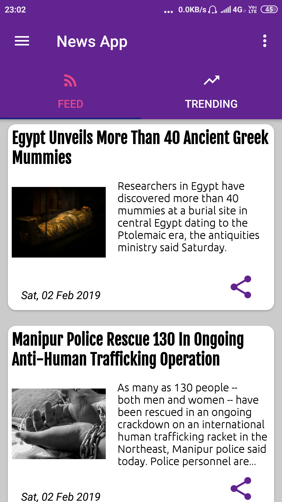
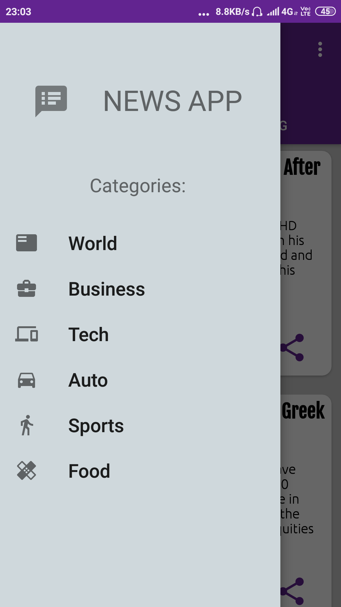

# NEWS APP 
## Get real-time updated news in summarised format for on-the-go reading.  

## Features:-
 
1. Get articles with headline, an image, a short summary and date.  
2. Feed: The place to get your dose of latest news and stay updated.  
3. Trending: Never miss the viral news making headlines.  
4. Categories of news to browse through.

* World
* Business
* Tech
* Auto
* Sports
* Food

5. Get notification of the top news in the Trending section even when the app is closed.   
6. Share any article headline with link to the original webpage.  
7. Visit the webpage of the article within the app by clicking on it.  
8. Who doesn't like Night mode in apps for late-night browsing. Enable Night mode in the Settings.  

     
 

9. Swipe to refresh to reload the feed on any page.

## Libraries/Tech used:
1. Picasso : To load images via URL  
2. Document Object Model XML parser : Used for parsing RSS feeds of articles on NDTV.  
3. RxJava2/RxAndroid2 : I used RxJava for background asynchronous calls to the RSS link and receiving data. I earlier used AsyncTask for the same job(as can be seen in the async branch) but upon realising that RxJava is better (more scalable and less error-prone), I switched to it for the same job. The branches can serve as a comparison for the code differences of the two methods achieving the same task i.e. retrieving data via a different thread.   
4. Broadcast Receiver and AlarmManager : Used to recieve notification intents to create a notification of the top trending news article at regualar intervals.  
5. Dagger : Used for dependency injection in the project. It helped me include loose-coupling between components.
